# MeDoraH

## Workflow Diagram

The following diagram illustrates the main workflow of ontology design in our project:

Some steps required to capture sufficent information before developing a prototype

The Ontology Population workflow provides a detailed breakdown of the process involved in populating the ontology with the interview data.

