# MeDoraH

## Workflow Diagrams

The following diagram illustrates the main workflow of ontology design in our project:

#### Some steps required to capture sufficent information before developing a prototype:

#### A breakdown of the Ontology Population workflow with the iterative refinement steps included:

