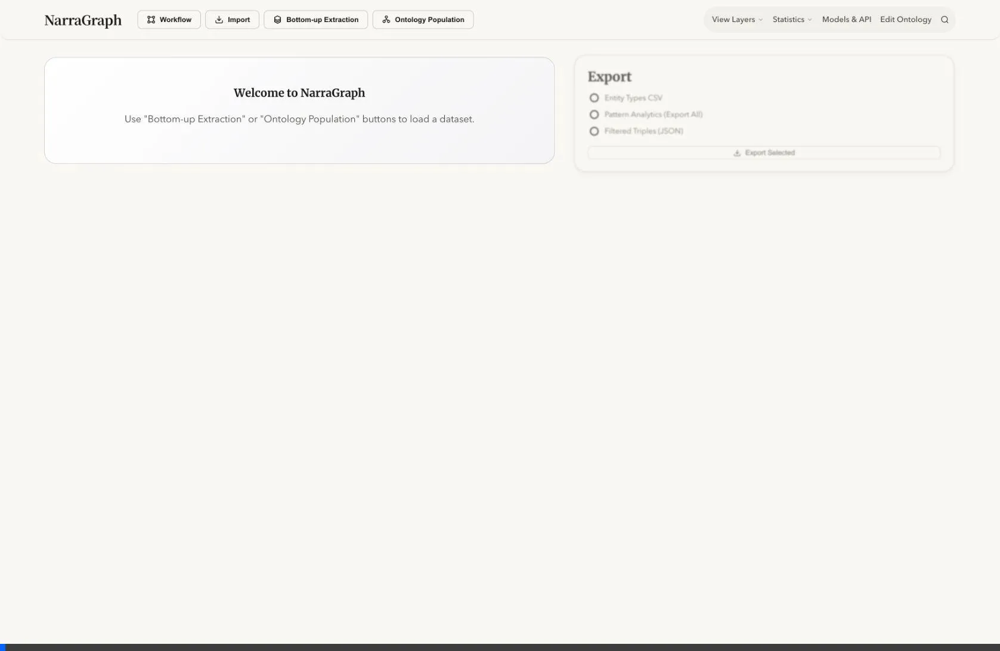
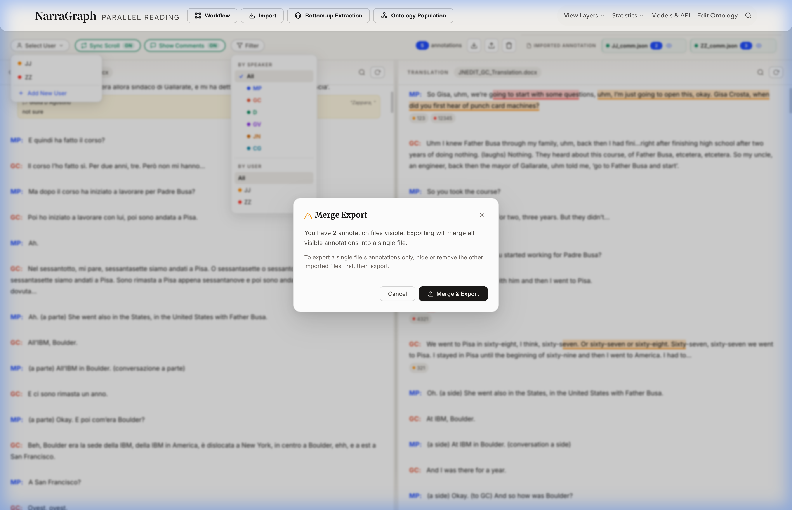

# Parallel Reading Feature Guide

The **Parallel Reading** feature in NarraGraph provides a powerful interface for analyzing transcripts and their translations side-by-side. Designed for researchers and linguists, it offers synchronised scrolling, granular annotation capabilities, and multi-user support.

## Getting Started

To access Parallel Reading:
1.  Navigate to the **Import** page.
2.  Click on the **Parallel Reading** card.
3.  **Import Files**:
    *   **Left Pane (Original)**: Upload your source transcript (`.docx`).
    *   **Right Pane (Translation)**: Upload the translated document (`.docx`).

> **Note**: The system automatically detects speaker initials (e.g., `GC:`, `JJ:`) to align paragraphs for synchronization.

## Key Features

### 1. Dual-Pane View & Synchronised Scrolling
*   **Side-by-Side Comparison**: View original text and translation simultaneously.
*   **Sync Scroll**: When enabled, scrolling one pane automatically scrolls the other to the corresponding paragraph. This ensures you never lose context while navigating long documents.
    *   *Toggle*: Click the `Sync Scroll` button in the toolbar to turn it ON/OFF.

### 2. Annotation System
NarraGraph allows for detailed annotation of the text:
*   **Highlight & Annotate**: Select any text, right-click, and choose **Add Annotation**.
*   **Tags & Comments**: Add custom tags (e.g., `#grammar`, `#context`) and detailed comments to your highlights.
*   **Import/Export**:
    *   Import existing annotation files (`.json`) to layer insights from multiple sessions.
    *   Export your work validation and sharing.

### 3. User & Speaker Filtering
Analyze specific contributions with powerful filters:
*   **By Speaker**: Filter to show only paragraphs spoken by specific individuals (e.g., `GC`, `JJ`).
*   **By User**: View annotations created by specific researchers.
    *   *Visualize*: Each user is assigned a unique color, making it easy to distinguish between annotators (as seen in the demo animation).

### 4. Merge Export
When working with multiple imported annotation layers, you can merge them into a unified dataset.

*   **How to use**:
    1.  Import multiple annotation files (e.g., `JJ_comm.json`, `ZZ_comm.json`).
    2.  Click **Export**.
    3.  A **Merge Export** dialog will appear if multiple files are visible, confirming that all visible annotations will be combined into a single JSON file.

## 📂 Example Files
This documentation utilizes the following example files for demonstration:
*   **Transcript**: `GC_Transcription.docx`
*   **Translation**: `JNEDIT_GC_Translation.docx`
*   **Annotations**: `JJ_comm.json`, `ZZ_comm.json`
